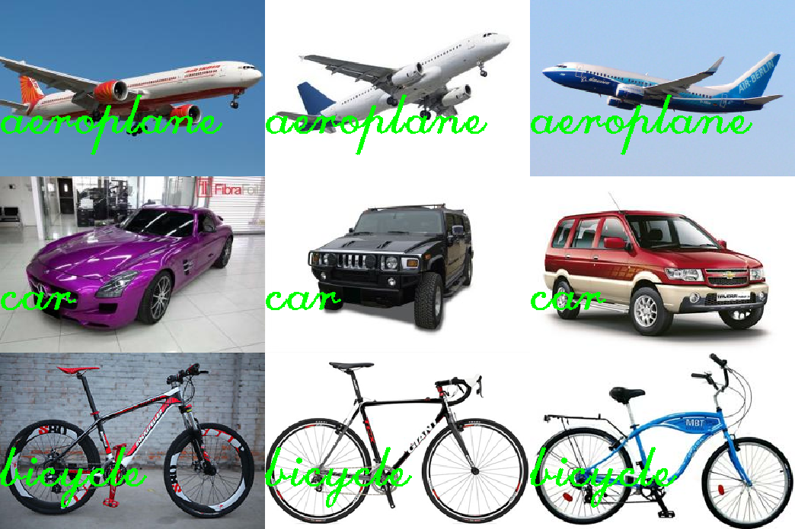

# bag-of-words

Image Recognition Algorithm of Bag of Words for Image Recognition using OpenCV (OCR) and
sklearn (LinearSVM)

## Training the classifier
```
python findFeatures.py -t dataset/train/
```

## Testing the classifier
* Testing a number of images
```
python getClass.py -t dataset/test --visualize
```
The `--visualize` flag will display the image with the corresponding label printed on the image/

* Testing a single image
```
python getClass.py -i dataset/test/aeroplane/test_1.jpg --visualize
```